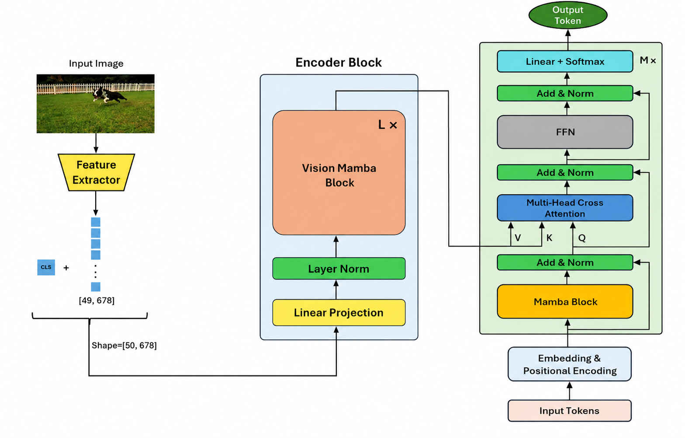

# HMT: A Hybrid Mamba–Transformer Architecture for Image Captioning

Official implementation of HMT – a novel encoder-decoder architecture for image captioning that combines Mamba's linear-time efficiency with Transformer's cross-modal alignment capabilities.

## Architecture Overview



**Encoder**: Vision Mamba with dual-path (horizontal + vertical) 2D scanning + gated feature fusion  
**Decoder**: Causal Mamba blocks + cross-attention for visual grounding  
**Backbone**: CLIP ViT-B/32 (frozen)

## Abstract

Image captioning requires efficient modeling of visual-linguistic interactions. Transformers excel at cross-modal alignment but suffer from quadratic complexity, while SSMs like Mamba offer linear scaling but struggle with multi-modal integration. HMT unifies both paradigms through: (1) a Vision Mamba encoder with cross-shaped 2D scanning that preserves spatial topology, (2) a gated feature fusion mechanism, and (3) a causal Mamba decoder with cross-attention. Evaluated on MS COCO and Flickr30k, HMT achieves superior accuracy with reduced computational overhead.

## Training Details

| Dataset | Hardware | Training Duration |
|---------|----------|-------------------|
| MS COCO | NVIDIA RTX 4090 (24GB) | 10.1 hours |
| Flickr30k | NVIDIA RTX 4090 (24GB) | 2.3 hours |

### Hyperparameters

| Parameter | Value |
|-----------|-------|
| Batch Size | 32 |
| Epochs | 5 |
| Optimizer | AdamW |
| Learning Rate | 1e-4 |
| Weight Decay | 0.01 |
| Label Smoothing | 0.1 |
| Gradient Clipping | 1.0 |
| Warmup Ratio | 0.05 |
| Scheduler | Cosine Annealing |
| Beam Search (inference) | 3 |

### Loss Function

Criterion: CrossEntropyLoss with `ignore_index=pad_token_id` and `label_smoothing=0.1`

## Datasets

| Dataset | Train | Validation | Test |
|---------|-------|------------|------|
| MS COCO | 113,287 | 5,000 | 5,000 |
| Flickr30k | 29,783 | 1,000 | 1,000 |

## Evaluation Metrics

BLEU1-4, METEOR, ROUGE-L, SPICE, CIDEr

## Quick Start

```bash
# Feature extraction
python -m HMT/feature_pipeline/run

# Training
python -m HMT/train

## 🔜 Coming Soon

- 📊 Full results & ablation studies
- 📄 Final paper
